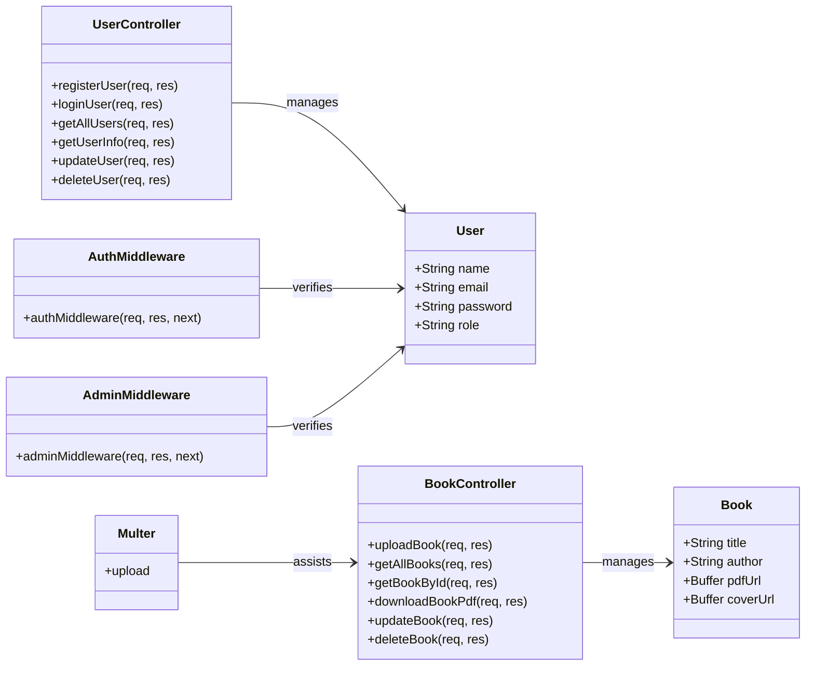

# API Ebooks Online

O projeto é uma API para uma livraria online, construída com Node.js e Express em parceria comm o programa Descodificadas. Ele inclui funcionalidades para gerenciar usuários e livros, com autenticação e autorização usando JWT. Aqui estão alguns dos principais componentes:

- Controladores (Controllers):
  - userController.js: Gerencia operações de usuário como registro, login, atualização e exclusão.
  - bookController.js: Gerencia operações de livro como upload, listagem, atualização e exclusão.
- Middlewares:
  - authMiddleware.js: Verifica a autenticação do usuário via JWT.
  - adminMiddleware.js: Verifica se o usuário autenticado é um administrador.
- Modelos (Models):
  - User.js: Define o esquema do usuário no MongoDB.
  - Book.js: Define o esquema do livro no MongoDB.
- Rotas (Routes):
  - userRoutes.js: Define as rotas relacionadas aos usuários.
  - bookRoutes.js: Define as rotas relacionadas aos livros.
- Configuração:
  - db.js: Configura a conexão com o MongoDB.
  - server.js: Configura o servidor Express e define as rotas principais.

---

## Endpoints

### Usuários

- **POST** `/users/register`: Registra um novo usuário.
- **POST** `/users/login`: Faz login de um usuário.
- **GET** `/users/:id`: Obtém informações de um usuário específico.
- **PUT** `/users/:id`: Atualiza informações de um usuário específico.
- **DELETE** `/users/:id`: Exclui um usuário específico.

### Livros

- **POST** `/books`: Adiciona um novo livro.
- **GET** `/books`: Lista todos os livros.
- **GET** `/books/:id`: Obtém informações de um livro específico.
- **PUT** `/books/:id`: Atualiza informações de um livro específico.
- **DELETE** `/books/:id`: Exclui um livro específico.
- **GET** `/books/search`: Busca livros com base em um termo de pesquisa.

---

## Instalação

1. **Clone o repositório**:

   ```bash
   git clone <URL_DO_REPOSITORIO>
   ```

2. **Navegue até o diretório do projeto**:

   ```bash
   cd nome-do-projeto
   ```

3. **Instale as dependências**:

   ```bash
   npm install
   ```

4. **Configure as variáveis de ambiente no arquivo `.env`**:
   ```plaintext
   MONGODB_URI=<sua_uri_do_mongodb>
   JWT_SECRET=<seu_segredo_jwt>
   ```

---

## Uso

1. **Inicie o servidor**:

   ```bash
   npm run dev
   ```

2. **Acesse a API**:
   ```plaintext
   http://localhost:3000
   ```

---

## Diagrama de Classes


