# API Ebooks Online

O projeto é uma API para uma livraria online, construída com Node.js e Express. Ele inclui funcionalidades para gerenciar usuários e livros, com autenticação e autorização usando JWT. Aqui estão alguns dos principais componentes:

- Controladores (Controllers):
  - userController.js: Gerencia operações de usuário como registro, login, atualização e exclusão.
  - bookController.js: Gerencia operações de livro como upload, listagem, atualização e exclusão.
- Middlewares:
  - authMiddleware.js: Verifica a autenticação do usuário via JWT.
  - adminMiddleware.js: Verifica se o usuário autenticado é um administrador.
- Modelos (Models):
  - User.js: Define o esquema do usuário no MongoDB.
  - Book.js: Define o esquema do livro no MongoDB.
- Rotas (Routes):
  - userRoutes.js: Define as rotas relacionadas aos usuários.
  - bookRoutes.js: Define as rotas relacionadas aos livros.
- Configuração:
  - db.js: Configura a conexão com o MongoDB.
  - server.js: Configura o servidor Express e define as rotas principais.

Aqui está um diagrama de classes básico para representar a estrutura do projeto:

```mermaid
classDiagram
    direction LR
    class User {
        +String name
        +String email
        +String password
        +String role
    }
    class Book {
        +String title
        +String author
        +Buffer pdfUrl
        +Buffer coverUrl
    }
    class UserController {
        +registerUser(req, res)
        +loginUser(req, res)
        +getAllUsers(req, res)
        +getUserInfo(req, res)
        +updateUser(req, res)
        +deleteUser(req, res)
    }
    class BookController {
        +uploadBook(req, res)
        +getAllBooks(req, res)
        +getBookById(req, res)
        +downloadBookPdf(req, res)
        +updateBook(req, res)
        +deleteBook(req, res)
    }
    class AuthMiddleware {
        +authMiddleware(req, res, next)
    }
    class AdminMiddleware {
        +adminMiddleware(req, res, next)
    }
    class Multer {
        +upload
    }

    UserController --> User : manages
    BookController --> Book : manages
    AuthMiddleware --> User : verifies
    AdminMiddleware --> User : verifies
    Multer --> BookController : assists

click UserController call linkCallback("controllers/userController.js")
click BookController call linkCallback("controllers/bookController.js")
click AuthMiddleware call linkCallback("middlewares/authMiddleware.js")
click AdminMiddleware call linkCallback("middlewares/adminMiddleware.js")
click User call linkCallback("models/User.js")
click Book call linkCallback("models/Book.js")
click Multer call linkCallback("utils/multer.js")
```

